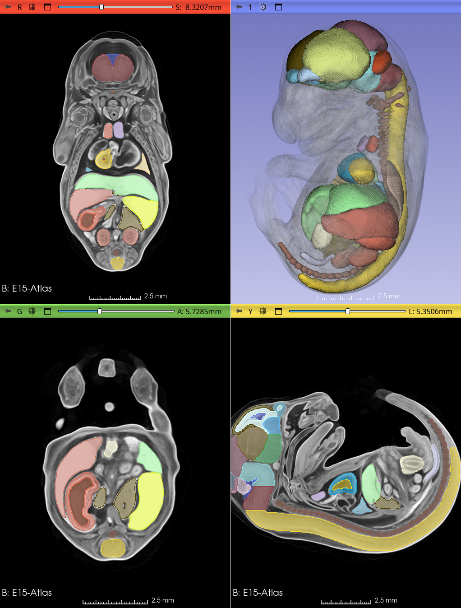

## MorphoDepot Repository
Repository for segmentation of a specimen scan.  See [this JSON file](MorphoDepotAccession.json) for specimen details.
* Species: Mus musculus
* Modality: Micro CT (or synchrotron)
* Contrast: Yes
* Dimensions: (594, 1046, 738)
* Spacing (mm): (0.017999999225139618, 0.017999999225139618, 0.017999999225139618)

## Screenshots

